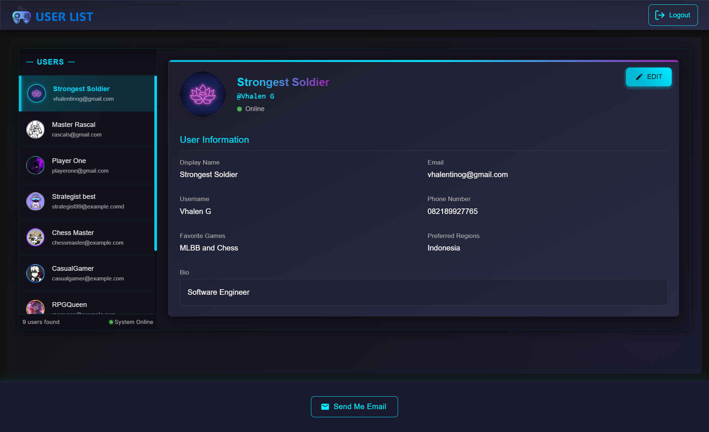
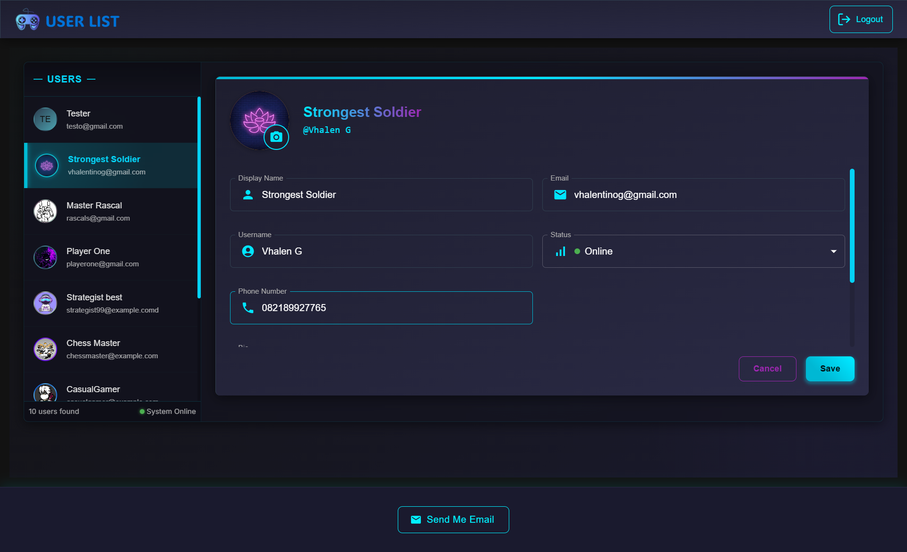
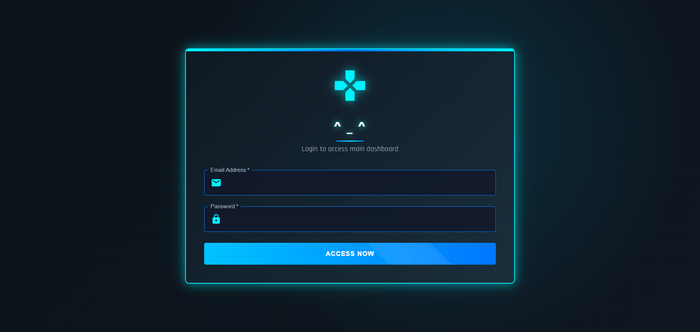

# GamesHub Repository

## Project Preview





This repository contains two approaches to run the application:

1. Standalone repositories (backend-repo and frontend-repo)
2. Monorepo structure (monorepo folder using TurboRepo)

## Technologies Used

- **Frontend**: Next.js 14
- **Backend**: Node.js & Firebase
- **Monorepo**: TurboRepo

## Firebase Firestore Setup (Required First)

1. Go to [Firebase Console](https://console.firebase.google.com/)
2. Create a new project or select your existing project
3. Navigate to Firestore Database in the left sidebar
4. Click "Create database" if you haven't already
5. Select a location for your database

### Creating USERS Collection

1. In Firestore, click "Start collection"
2. Enter "USERS" as the Collection ID
3. Add documents with the following schema:

```typescript
interface User {
  id: string;
  email: string;
  displayName: string;
  photoURL?: string;
  phoneNumber?: string;
  username: string;
  status: "online" | "offline" | "in-game" | "away";
  favoriteGames: string;
  bio: string;
  preferredRegions: string;
  createdAt: string;
  updatedAt: string;
}
```

### Downloading Service Account Key

1. In Firebase Console, go to Project Settings
2. Go to the "Service accounts" tab
3. Click "Generate new private key"
4. Save the downloaded file as `serviceAccountKey.json` in the respective backend directory

## Option 1: Standalone Repositories

### Backend Setup (backend-repo with Node.js)

```bash
# Navigate to backend directory
cd backend-repo

# Install dependencies
npm install
```

#### Environment Setup (Backend)

Create a `.env` file in the backend-repo directory:

```
FIREBASE_SERVICE_ACCOUNT_PATH=./serviceAccountKey.json
```

Note: Place your downloaded `serviceAccountKey.json` in the backend root.

#### Running Backend

```bash
# Development mode
npm run dev

# Production build
npm run build

# Start production server
npm run start
```

### Frontend Setup (frontend-repo with Next.js 14)

```bash
# Navigate to frontend directory
cd frontend-repo

# Install dependencies
npm install
```

#### Environment Setup (Frontend)

Create a `.env.local` file in the frontend-repo directory:

```
# Firebase Configuration
NEXT_PUBLIC_FIREBASE_API_KEY=your-api-key
NEXT_PUBLIC_FIREBASE_AUTH_DOMAIN=your-project-id.firebaseapp.com
NEXT_PUBLIC_FIREBASE_PROJECT_ID=your-project-id
NEXT_PUBLIC_FIREBASE_STORAGE_BUCKET=your-project-id.appspot.com
NEXT_PUBLIC_FIREBASE_MESSAGING_SENDER_ID=your-sender-id
NEXT_PUBLIC_FIREBASE_APP_ID=your-app-id

# Optional configurations
NEXT_PUBLIC_FIREBASE_MEASUREMENT_ID=your-measurement-id

# API Configuration
NEXT_PUBLIC_USE_FIREBASE_EMULATOR=true
NEXT_PUBLIC_FIREBASE_REGION=us-central1
NEXT_PUBLIC_API_URL=http://localhost:5000/api
```

#### Running Frontend

```bash
# Development mode
npm run dev

# Production build
npm run build

# Start production server
npm run start
```

## Option 2: Monorepo Structure with TurboRepo

### Monorepo Setup

```bash
# Navigate to monorepo directory
cd monorepo

# Install dependencies at the root level
npm install
```

### Nested Backend Setup

```bash
# Navigate to the nested backend directory
cd monorepo/apps/backend

# Install dependencies
npm install

# Build the nested backend
npm run build
```

#### Running with TurboRepo

```bash
# At the monorepo root
npm run dev    # Run all apps in development mode
npm run build  # Build all apps
```

#### Running Specific Apps

```bash
# Run only backend
npm run dev --filter=backend

# Run only frontend
npm run dev --filter=frontend
```

#### Individual App Setup

If you need to work directly with apps in the monorepo:

```bash
# Backend in monorepo
cd monorepo/apps/backend
npm install
npm run dev

# Frontend in monorepo (Next.js 14)
cd monorepo/apps/frontend
npm install
npm run dev
```

### Environment Setup (Monorepo)

Create environment files in the respective app directories:

For backend: `monorepo/apps/backend/.env`

```
FIREBASE_SERVICE_ACCOUNT_PATH=./serviceAccountKey.json
```

For frontend: `monorepo/apps/frontend/.env.local`

```
# Firebase Configuration
NEXT_PUBLIC_FIREBASE_API_KEY=your-api-key
NEXT_PUBLIC_FIREBASE_AUTH_DOMAIN=your-project-id.firebaseapp.com
NEXT_PUBLIC_FIREBASE_PROJECT_ID=your-project-id
NEXT_PUBLIC_FIREBASE_STORAGE_BUCKET=your-project-id.appspot.com
NEXT_PUBLIC_FIREBASE_MESSAGING_SENDER_ID=your-sender-id
NEXT_PUBLIC_FIREBASE_APP_ID=your-app-id

# Optional configurations
NEXT_PUBLIC_FIREBASE_MEASUREMENT_ID=your-measurement-id

# API Configuration
NEXT_PUBLIC_USE_FIREBASE_EMULATOR=true
NEXT_PUBLIC_FIREBASE_REGION=us-central1
NEXT_PUBLIC_API_URL=http://localhost:5000/api
```
